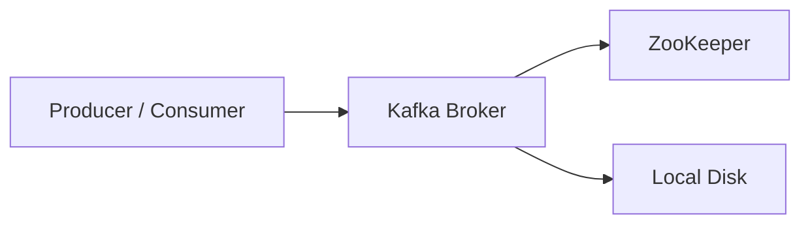
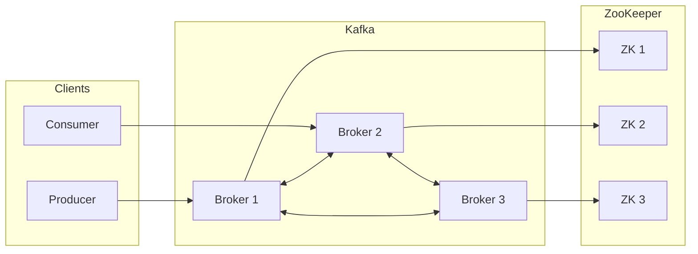

---
# Kafka ARM Docker Cluster

<p>


</p>

---

## The Story Behind This Repo (Why This Exists)

I originally built this because my in-house team was struggling - *really struggling* - to manage Kafka natively on a 3-node HPC cluster. Every update felt like open-heart surgery. Every restart felt like a prayer.

Kafka + ZooKeeper + Native Linux installs =
**“Works on my machine” × 100**

So instead of arguing over JVM flags and scattered config files, I decided to do what every tired engineer eventually does:

**Spin up Docker. Simplify. Isolate. Reproduce.**

Now here’s the fun part - I didn’t test this on a powerful workstation.
I tested it on **Raspberry Pi 3B+ boards.**

Yes.
Those tiny, low-power, outdated, under-appreciated little machines.

Why?

Because if Kafka can run reliably there, it can run **anywhere**.

---

## The Spark

While exploring ARM Kafka setups, I came across an older repository:

[https://github.com/osodevops/kafka-arm-images](https://github.com/osodevops/kafka-arm-images)

Great idea - but four years old.

Meanwhile, I already had a 7-node Pi cluster running k3s:

[https://github.com/855princekumar/EdgeStack-K3s](https://github.com/855princekumar/EdgeStack-K3s)

But… the team wasn’t ready for Kubernetes.
They wanted something simpler. Something **docker-compose-level simple.**

So I rebuilt the entire Kafka + ZooKeeper stack for ARM from scratch.

---

## The Reality Check

What followed was… character building.

* I forgot half the Kafka commands.
* I forgot which config file controls what.
* I broke ZooKeeper more times than I’d like to admit.
* Containers restarted like they had anxiety.
* Ports clashed with k3s.
* JVM ate RAM like popcorn.
* Logs became bedtime stories.

And yes - **ChatGPT helped a lot.**
Not going to pretend otherwise 😄

After **three straight days**, the cluster finally stabilized.

Single node worked.
3-node HA worked.
Failover worked.
Persistence worked.

And at that point the thought was simple:

> “If this works on these mini cute little Pi boards…
> then production hardware will be a piece of cake.”

So this repository was born - not as theory, but as a tested baseline.

---

# What This Repository Gives You

A **ready-to-run Kafka + ZooKeeper environment** designed for:

* Raspberry Pi clusters
* ARM servers
* x86 machines
* Edge labs
* IoT pipelines
* HA experimentation without losing sanity

Two deployment modes:

**Single Node Mode** – fast, tiny, demo-friendly.
**High Availability Mode** – leader election, replication, failover.

Same images. Different configs.
Swap `.env`, restart, done.
Hot-swap friendly.

---

# Real-World Result Snapshot

Below is a live test where frames were captured on a Windows machine and streamed over the LAN into the Kafka cluster running on Raspberry Pi3B+ nodes.


---

# Docker Images

Pre-built ARM-optimized images are publicly available on Docker Hub.

Kafka Image
[https://hub.docker.com/r/devprincekumar/kafka-arm](https://hub.docker.com/r/devprincekumar/kafka-arm)

ZooKeeper Image
[https://hub.docker.com/r/devprincekumar/zookeeper-arm](https://hub.docker.com/r/devprincekumar/zookeeper-arm)

You can either:

* Pull directly and run instantly
* Build locally using the provided Dockerfiles
* Fork and customize JVM, configs, or health checks

If you just want to test quickly, **pulling is the fastest path.**
If you want control, build locally.
If you want pain, compile Kafka natively.
(We don’t recommend the third option unless you enjoy existential debugging.)

# Image Compatibility & Supported Systems

This project provides **pre-built Docker images optimized for ARM devices**, originally built and tested on **Raspberry Pi 3B+ (ARMv7 / 32-bit Linux)**.

Understanding architecture compatibility will help you avoid pull/run errors.

---

## Architecture of Pre-Built Images

The public images on Docker Hub are built for:

```
linux/arm/v7
```

This means they are **native for 32-bit ARM systems** and run without emulation.

---

## Systems That Work Natively

These systems can pull and run the images directly without modification:

| Device / Platform              | Result          |
| ------------------------------ | --------------- |
| Raspberry Pi 2 / 3 / 3B / 3B+  | Fully Supported |
| Raspberry Pi 4 / 5 (32-bit OS) | Fully Supported |
| Orange Pi (ARMv7 variants)     | Supported       |
| ARMv7 Single Board Computers   | Supported       |
| Low-Power Edge ARM Devices     | Supported       |

---

## Systems That *May* Work (With Conditions)

| Device                         | Condition                                          |
| ------------------------------ | -------------------------------------------------- |
| Raspberry Pi 4 / 5 (64-bit OS) | Needs 32-bit compatibility layer                   |
| ARM64 Servers                  | Use `--platform linux/arm/v7` or rebuild image     |
| Apple Silicon (M1/M2/M3)       | Emulation required, not recommended for production |

---

## Systems Not Supported Directly

| Device / Platform           | Reason                    |
| --------------------------- | ------------------------- |
| Intel / AMD PCs             | x86 architecture mismatch |
| Cloud x86 VMs               | Different CPU ISA         |
| Windows Native Docker (x86) | Requires rebuild          |
| Standard Ubuntu Desktop PCs | Requires rebuild          |

## Resource Guidance & Hardware Benchmarks

This setup is optimized for low-power ARM boards but can scale to higher-end hardware.
Kafka is JVM-based, so RAM and disk speed significantly affect stability.

### Minimum Recommended Resources

| Deployment Mode   | RAM (Per Node)    | CPU      | Storage       | Notes                      |
| ----------------- | ----------------- | -------- | ------------- | -------------------------- |
| Single Node Test  | 1 GB              | 2 Core   | SD Card       | Works on Pi 3B+ with swap  |
| HA 3-Node Cluster | 1–2 GB            | 2–4 Core | SSD Preferred | Stable for light workloads |
| Production Edge   | 4 GB+             | 4 Core   | SSD/NVMe      | Recommended                |
| Pi Zero / 512MB   | Not Recommended   |   -----  |   ------      | JVM instability likely     |

---

### Kafka JVM Heap Guidance

| RAM Available | Suggested Heap      |
| ------------- | ------------------- |
| 1 GB          | `-Xms256m -Xmx512m` |
| 2 GB          | `-Xms512m -Xmx1g`   |
| 4 GB+         | `-Xms1g -Xmx2g`     |

---

### Swap Guidance

| Device      | Swap Advice                |
| ----------- | -------------------------- |
| Pi 3B+      | 512MB–1GB swap recommended |
| Pi 4/5      | Optional                   |
| SSD Systems | Avoid excessive swap       |

---

### Disk I/O Impact

| Storage Type | Performance               |
| ------------ | ------------------------- |
| SD Card      | Slow / acceptable for POC |
| USB SSD      | Good                      |
| NVMe         | Excellent                 |

---

### Observed Benchmarks (POC Level)

| Hardware       | Mode        | Stability           |
| -------------- | ----------- | ------------------- |
| Pi 3B+ 1GB     | Single Node | Stable              |
| Pi 3B+ 1GB     | HA 3-Node   | Stable (Light Load) |
| Pi 4 4GB       | HA          | Excellent           |
| x86 Laptop 8GB | HA          | Production-Ready    |

---

**Key Insight:**
If it runs on Pi 3B+, it will run comfortably on modern hardware.

---

## How to Check Image Architecture

Users can inspect the image architecture with:

```
docker buildx imagetools inspect devprincekumar/kafka-arm:3.7.0
```

Expected output snippet:

```
Architecture: arm
Variant: v7
```

---

## Want x86 or ARM64 Support?

You can build a **multi-architecture image** locally using Docker Buildx:

```
docker buildx build \
  --platform linux/amd64,linux/arm64,linux/arm/v7 \
  -t yourrepo/kafka-arm:latest \
  --push .
```

This allows one tag to support **PCs, Servers, and ARM devices simultaneously.**

---

## Practical Summary

| Use Case                  | Recommendation      |
| ------------------------- | ------------------- |
| Raspberry Pi Cluster      | Use Pre-Built Image |
| Edge / IoT ARM Devices    | Use Pre-Built Image |
| Personal Laptop / Desktop | Rebuild Multi-Arch  |
| Cloud Server Deployment   | Rebuild Multi-Arch  |

If it runs on a Pi 3B+, it will fly on proper ARM servers -
but for x86 systems, rebuilding is the correct path.

---

# Architecture Overview

This project scales from
“just testing something real quick”
to
“okay this actually needs redundancy.”

---

## Single Node Architecture

Optimized for:

* Development
* Edge testing
* Lightweight ingestion
* Quick demos

No replication. No failover.
But blazing simple.

**Logical Flow**

Client → Kafka → ZooKeeper → Disk

### Mermaid – Single Node



### Characteristics

| Feature        | Status        |
| -------------- | ------------- |
| Replication    | Disabled      |
| Failover       | No            |
| ISR            | Not Used      |
| Storage        | Local         |
| Resource Usage | Very Low      |
| Ideal For      | Dev & Testing |

---

## High Availability 3-Node Cluster

This is where things become fun.

* Leader election
* Data replication
* Automatic failover
* ISR enforcement
* Consensus logic
* Distributed persistence

One node can die.
Cluster keeps running.
You sleep peacefully.

### Mermaid – HA Cluster



### Characteristics

| Feature        | Status            |
| -------------- | ----------------- |
| Replication    | Enabled           |
| Failover       | Automatic         |
| ISR            | Enforced          |
| Persistence    | Distributed       |
| Resource Usage | Medium            |
| Ideal For      | IoT / Edge / Labs |

---

# Deployment Flow

The **docker-compose file is common across nodes.**
Only the `.env` file changes per node.

---

## Step-by-Step Deployment

### 1. Assign Static IPs

Each node must have a fixed IP.

### 2. Copy the Node Folder

Copy the appropriate node folder to each machine.

### 3. Update `.env`

Change only:

* NODE_ID
* HOST_IP

Everything else remains identical.

---

# Environment Configuration (`.env` Required)

⚠️ **Important:**
This project **requires a `.env` file in the same folder as `docker-compose.yml`.**

The `.env` file is **not included in this repository** because environment files are ignored by Git for safety reasons.

If you skip this step, containers will start incorrectly and Kafka / ZooKeeper will behave unpredictably.

---

## How to Create `.env`

In the same folder as `docker-compose.yml`, create a file named:

```
.env
```

Then paste the configuration based on your node type.

---

## Single Node Mode (`.env`)

Use this when running Kafka + ZooKeeper on **one machine only**.

```
NODE_ID=1
HOST_IP=127.0.0.1

KAFKA_ZOOKEEPER_CONNECT=127.0.0.1:2181

KAFKA_NUM_PARTITIONS=1
KAFKA_DEFAULT_REPLICATION_FACTOR=1
KAFKA_MIN_INSYNC_REPLICAS=1
KAFKA_OFFSETS_TOPIC_REPLICATION_FACTOR=1
KAFKA_TRANSACTION_STATE_LOG_REPLICATION_FACTOR=1
KAFKA_TRANSACTION_STATE_LOG_MIN_ISR=1
```

---

## High Availability – Node 1 (`.env`)

```
NODE_ID=1
HOST_IP=192.168.126

KAFKA_ZOOKEEPER_CONNECT=192.168.126:2181,192.168.127:2181,192.168.128:2181

KAFKA_NUM_PARTITIONS=1
KAFKA_DEFAULT_REPLICATION_FACTOR=3
KAFKA_MIN_INSYNC_REPLICAS=2
KAFKA_OFFSETS_TOPIC_REPLICATION_FACTOR=3
KAFKA_TRANSACTION_STATE_LOG_REPLICATION_FACTOR=3
KAFKA_TRANSACTION_STATE_LOG_MIN_ISR=2
```

---

## High Availability – Node 2 (`.env`)

```
NODE_ID=2
HOST_IP=192.168.127

KAFKA_ZOOKEEPER_CONNECT=192.168.126:2181,192.168.127:2181,192.168.128:2181

KAFKA_NUM_PARTITIONS=1
KAFKA_DEFAULT_REPLICATION_FACTOR=3
KAFKA_MIN_INSYNC_REPLICAS=2
KAFKA_OFFSETS_TOPIC_REPLICATION_FACTOR=3
KAFKA_TRANSACTION_STATE_LOG_REPLICATION_FACTOR=3
KAFKA_TRANSACTION_STATE_LOG_MIN_ISR=2
```

---

## High Availability – Node 3 (`.env`)

```
NODE_ID=3
HOST_IP=192.168.128

KAFKA_ZOOKEEPER_CONNECT=192.168.126:2181,192.168.127:2181,192.168.128:2181

KAFKA_NUM_PARTITIONS=1
KAFKA_DEFAULT_REPLICATION_FACTOR=3
KAFKA_MIN_INSYNC_REPLICAS=2
KAFKA_OFFSETS_TOPIC_REPLICATION_FACTOR=3
KAFKA_TRANSACTION_STATE_LOG_REPLICATION_FACTOR=3
KAFKA_TRANSACTION_STATE_LOG_MIN_ISR=2
```

---

## Folder Placement (Very Important)

Your directory **must** look like this:

```
node-1/
 ├─ docker-compose.yml
 ├─ .env
 └─ data/
```

If `.env` is missing or in another folder, Docker Compose will not load variables and the cluster will fail silently.

---

## Why `.env` Is Not in the Repo

`.env` files are excluded intentionally to avoid leaking:

* passwords
* tokens
* secrets
* private IPs

This is industry best practice.

---

## Quick Sanity Check

After creating `.env`, run:

```
docker compose config
```

If variables expand correctly — you’re good.
If you see `${NODE_ID}` literally — your `.env` is not being read.

---

## 4. Start ZooKeeper First - Always

Run on **all nodes:**

```
docker compose up -d zookeeper
```

Then **WAIT 30–60 seconds.**

Yes, really wait.
Distributed systems dislike impatience.

---

## 5. Start Kafka

```
docker compose up -d kafka
```

Now brokers join cleanly.

---

# Very Important Operational Rule

**Do NOT randomly restart everything.**

ZooKeeper is the brain.
Kafka is the muscle.

Restarting the brain mid-thought makes the muscle forget what it was lifting.

---

## Correct Restart Procedure

```
docker compose down kafka
docker compose up -d kafka
```

Avoid `docker compose down` for the entire stack unless intentionally shutting down.

Stopping ZooKeeper unnecessarily can:

* Break quorum
* Trigger re-elections
* Cause ISR shrink
* Confuse brokers
* Make you question life decisions

---

## Safe Restart Matrix

| Scenario            | Correct Action                       |
| ------------------- | ------------------------------------ |
| Kafka config change | Restart Kafka only                   |
| Kafka crash         | Restart Kafka only                   |
| Node reboot         | Start ZooKeeper → wait → start Kafka |
| ZooKeeper crash     | Restart ZooKeeper, then Kafka        |
| Full maintenance    | Stop Kafka first, ZooKeeper last     |

---

# Post-Deployment Validation

## Container Check

```
docker ps
```

## ZooKeeper Quorum

```
docker logs zookeeper-1 | grep leader
docker logs zookeeper-2 | grep follower
docker logs zookeeper-3 | grep follower
```

## Broker Visibility

```
docker exec kafka-1 kafka-broker-api-versions.sh --bootstrap-server <node-ip>:9092
```

## HA Topic Creation

```
kafka-topics.sh --create --topic ha-proof --replication-factor 3
```

## Failover Simulation

```
docker stop kafka-2
docker start kafka-2
```

## Persistence Test

Produce → Restart → Consume → Message survives.

---

# Persistence Design

Volumes mounted:

* `./data/kafka`
* `./data/zookeeper`

Delete them only if you **want amnesia.**

---

# Troubleshooting Highlights

Kafka restarting loop? JVM memory.
ZooKeeper standalone? Missing `myid`.
Ports blocked? k3s or firewall.
Nothing works? Breathe. Restart clean.

---
## Live Streaming Test (Producer → Kafka → Consumer)

This repository also includes **ready-to-run testing scripts** that demonstrate real-time video streaming through the Kafka cluster.

Instead of sending simple text messages, this test proves:

* Frame ingestion
* Topic auto-creation
* Distributed replication
* End-to-end delivery
* Persistence across restarts

### Test Setup

**Producer:**
Uses OpenCV to capture frames from a USB webcam or RTSP stream and pushes them to Kafka.

**Consumer:**
Reads frames from the Kafka topic and displays them using OpenCV.

Both scripts:

* Auto-create a virtual environment
* Install dependencies automatically
* Run isolated from system Python
* Require zero manual setup

---

### Producer Configuration

```
BROKERS = ["192.168.1.26:9092","192.168.1.27:9092","192.168.1.28:9092"]
TOPIC = "D1Cam"
```

---

### Consumer Configuration

```
BROKERS = ["192.168.1.26:9092","192.168.1.27:9092","192.168.1.28:9092"]
TOPIC = "D1Cam"
```

---

### Execution

Producer:

```
python producer.py
```

Consumer:

```
python consumer.py
```

If frames appear in the consumer window, the pipeline is verified.

---

### What This Test Validates

* Auto topic creation
* Broker discovery
* Frame serialization/deserialization
* ISR synchronization
* Disk persistence
* Cluster failover stability

---

### Practical Outcome

This confirms the cluster is capable of:

* Video ingestion
* High-throughput streaming
* Edge AI pipelines
* IoT telemetry aggregation
* Stress testing under real load

---

# Scalability

Tested on:

* 1 node
* 3 nodes

Can scale to 5, 6, 7 nodes easily.
Odd numbers recommended - consensus logic enjoys symmetry as much as developers enjoy dark mode.

---

# Practical Streaming Use Case - RTSP Video Ingestion

Before this repository became a full cluster project, the original goal was reducing video ingestion headaches.

Template Repository:
[https://github.com/855princekumar/rtsp-kafka-ingestion-template](https://github.com/855princekumar/rtsp-kafka-ingestion-template)

This allows:

* Live camera ingestion
* Stress testing
* Throughput measurement
* ISR observation
* Disk I/O visibility
* Marshmallow-level Pi roasting 🔥

Cluster → Real Workload → Stress → Confidence.

---

# Use Cases

* IoT sensor ingestion
* Audio/video pipelines
* Edge AI
* MQTT bridges
* Lab simulations
* Teaching distributed systems without tears

---

# Final Thoughts

This project exists because:

* Native Kafka installs are painful.
* ARM deserves first-class tooling.
* Pi clusters are underrated.
* Simplicity beats complexity for adoption.

If it runs on a Pi 3B+,
it will fly on your server.

And if this repo saves you even one weekend of debugging ZooKeeper…

**Then it has already done its job. ⭐**


